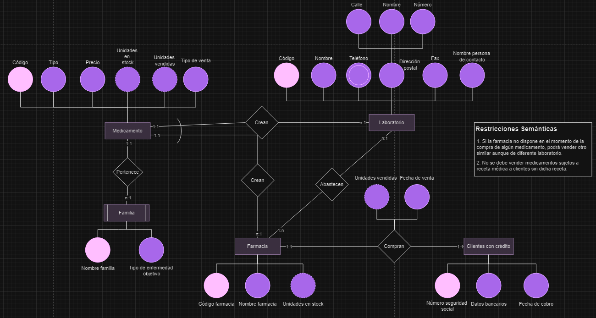

# Modelo Entidad-Relación para Farmacia

Este modelo, diseñado para una farmacia, incluye las entidades fuertes Medicamento, Laboratorio, Farmacia y Clientes con crédito, con sus respectivos atributos y relaciones. Con el fin de gestionar la farmacia de manera eficiente, hemos diseñado un modelo que permite controlar el inventario, las ventas y los clientes.

## Entidades y Atributos

### 1. **Medicamento**
   - **Descripción**: Representa los distintos productos farmacéuticos disponibles en la farmacia.
   - **Atributos**:
     - **Código**: Identificador único para cada medicamento (por ejemplo, `M001`).
     - **Tipo**: Clasificación del medicamento según su uso, como antibiótico, analgésico, etc.
     - **Precio**: Costo del medicamento expresado en euros (ej: `12.99€`).
     - **Unidades en stock**: Cantidad de unidades disponibles actualmente (ej: `150`).
     - **Unidades vendidas**: Número de unidades vendidas de cierto medicamento.
     - **Tipo de venta**: Define si el medicamento requiere receta (`Con receta`) o es de venta libre (`Sin receta`).

### 2. **Laboratorio**
   - **Descripción**: Representa los laboratorios que fabrican los medicamentos.
   - **Atributos**:
     - **Código**: Identificador único del laboratorio (ej: `LAB01`).
     - **Nombre**: Nombre del laboratorio (ej: `Laboratorios Bayer`).
     - **Teléfono**: Número de contacto del laboratorio.
     - **Dirección postal**:
       - **Calle, Número, Nombre**: Datos específicos de la ubicación del laboratorio.
     - **Fax**: Número de fax del laboratorio.
     - **Nombre persona de contacto**: Nombre del representante principal del laboratorio.

### 3. **Familia**
   - **Descripción**: Clasificación de medicamentos basada en el tipo de enfermedad o tratamiento.
   - **Atributos**:
     - **Nombre familia**: Nombre de la categoría (ej: `Antiinflamatorios`).
     - **Tipo de enfermedad objetivo**: Enfermedad o condición para la que está destinada esta familia de medicamentos (ej: `Dolor muscular`).

### 4. **Farmacia**
   - **Descripción**: Representa a la tienda física donde se venden los medicamentos.
   - **Atributos**:
     - **Código farmacia**: Identificador único para cada farmacia (ej: `FAR001`).
     - **Nombre farmacia**: Nombre de la farmacia (ej: `Farmacia San José`).
     - **Unidades en stock**: Cantidad de cada medicamento disponible en la farmacia.

### 5. **Clientes con crédito**
   - **Descripción**: Clientes con un acuerdo de crédito que les permite comprar a crédito.
   - **Atributos**:
     - **Número seguridad social**: Identificador del cliente con su número de seguridad social. (ej: `123456789012`).
     - **Datos bancarios**: Información bancaria para el manejo del crédito. (ej: `IBAN`).
     - **Fecha de cobro**: Fecha en la cual se realizará el cobro de la compra realizada. (ej: `01/01/2022`).

## Relaciones y Cardinalidad

### 1. **Relación "Crean" (Laboratorio - Medicamento)**
   - **Descripción**: Define que un laboratorio produce ciertos medicamentos.
   - **Cardinalidad**: **`1:N`**. Un laboratorio puede producir múltiples medicamentos, pero cada medicamento es producido por un solo laboratorio.

### 2. **Relación "Pertenece" (Medicamento - Familia)**
   - **Descripción**: Clasifica cada medicamento dentro de una familia que describe su uso terapéutico.
   - **Cardinalidad**: **`N:1`**. Varios medicamentos pueden pertenecer a una misma familia, pero cada medicamento está asociado a una sola familia.

### 3. **Relación "Crean" (Farmacia - Medicamento)**
   - **Descripción**: Representa que algunos medicamentos son creados por una farmacia.
   - **Cardinalidad**: **`1:N`**. Una farmacia puede producir múltiples medicamentos, pero cada medicamento es producido por una sola farmacia.

### 4. **Relación "Compran" (Farmacia - Clientes con crédito)**
   - **Descripción**: Indica los clientes que compran medicamentos en la farmacia mediante crédito.
   - **Cardinalidad**: **`1:1`**. Cada compra de un cliente a crédito está registrada en una sola farmacia.

### 5. **Relación "Abastecen" (Laboratorio - Farmacia)**
   - **Descripción**: Define que un laboratorio abastece a una farmacia con medicamentos.
   - **Cardinalidad**: **`N:M`**. Un laboratorio puede abastecer a varias farmacias, y una farmacia puede ser abastecida por varios

## Restricciones Semánticas

1. Si la farmacia no dispone en el momento de la compra de algún medicamento, podrá vender otro similar aunque de diferente laboratorio.
2. No se debe vender medicamentos sujetos a receta médica a clientes sin dicha receta.

---

Este modelo describe cada entidad y sus atributos, además de las relaciones y restricciones relevantes para la operación de la farmacia, asegurando el control de inventarios y el cumplimiento de las normativas de venta.
